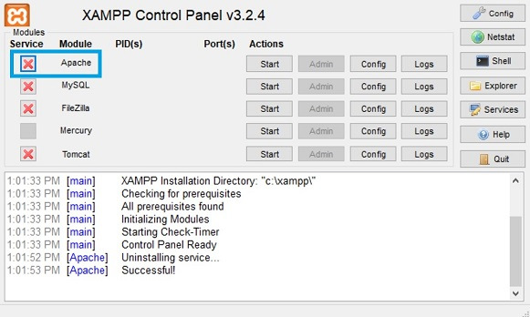
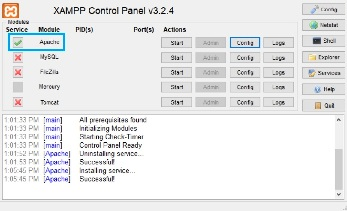
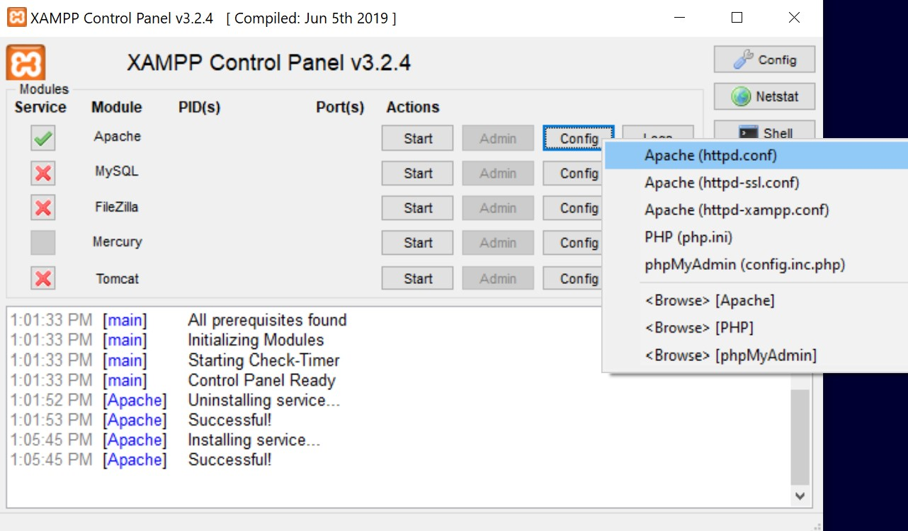
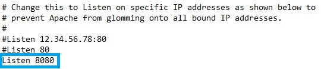
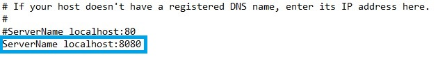
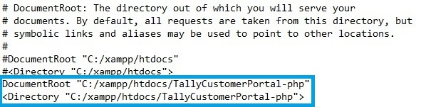
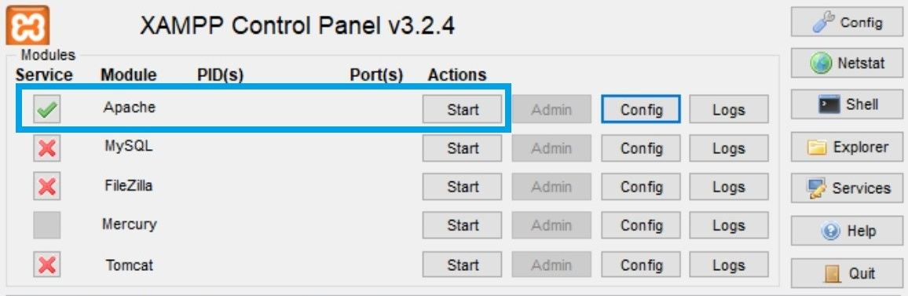
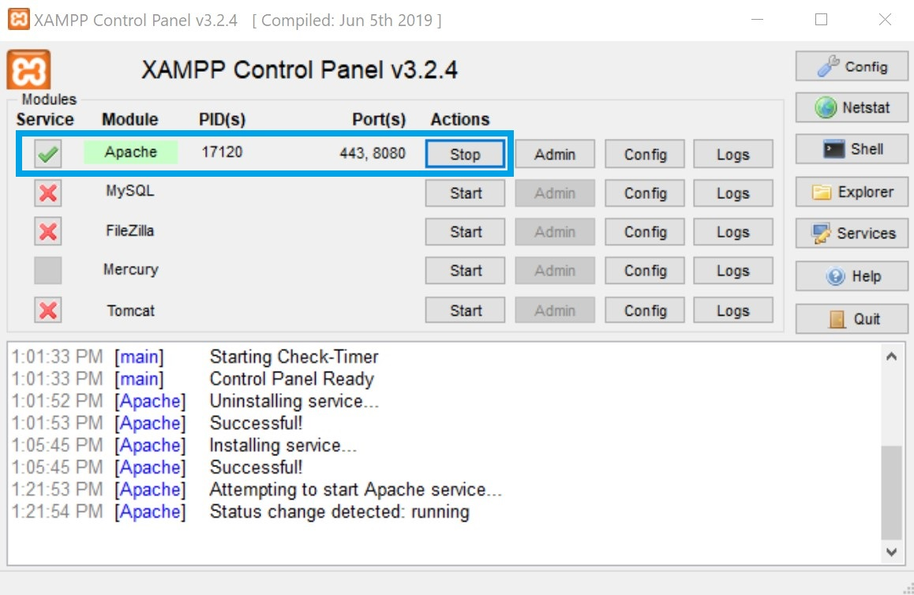
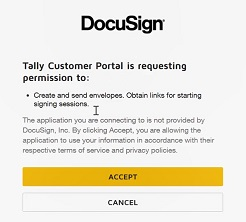

## XAMPP/Apache web server installation

XAMPP/Apache can be configured to run the PHP launcher.

**Step 1.** Download [XAMPP](https://www.apachefriends.org/download.html).

**Step 2.** Run XAMPP as administrator.

**Step 3.** On the XAMPP Control Panel, to the left of Apache, select the red "X" to install Apache. 

The red "X" should become a green checkmark.

## Apache web server configuration

**Step 1.** On the XAMPP Control Panel, to the right of Apache, select the Config button > Apache (httpd.conf). The httpd.conf file should open.

**Step 2.** In httpd.conf, change the default "Listen 80" to "Listen 8080".

**Step 3.** In httpd.conf, change the default "ServerName localhost:80" to "ServerName localhost:8080".

**Step 4.** In httpd.conf, change the default 
DocumentRoot "C:/xampp/htdocs" 
<Directory "C:/xampp/htdocs"> 
to 
DocumentRoot "C:/xampp/htdocs/<Quickstart_folder_name>" 
<Directory "C:/xampp/htdocs/<Quickstart_folder_name>"> 

In httpd.conf, use Ctrl-S to save your changes.

**Step 5.** On the XAMPP Control Panel, to the right of Apache, select the Start button. 

Apache should run.

**Step 6.** Open [http://localhost:8080/public](http://localhost:8080/public).

If this is your first time opening the PHP Quickstart launcher, you should see the DocuSign OAuth consent window. Select the Accept button and continue to the embedded signing code example.

